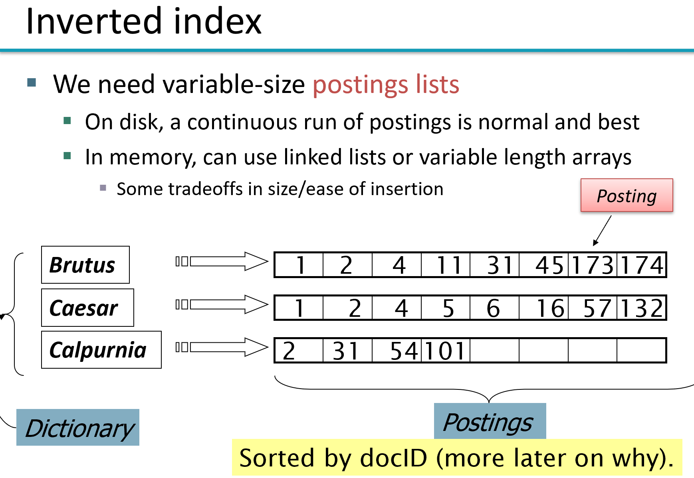
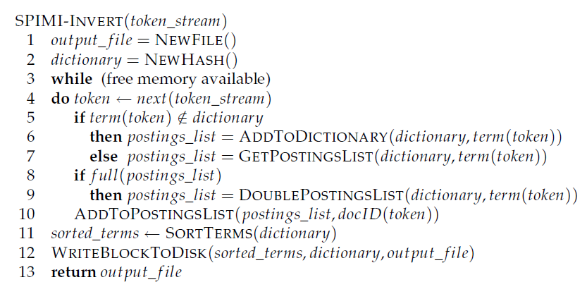

建立索引是 information retrieval 的一个核心问题，这一节简单记录关于index的相关笔记.

# text preprocessing 

一些术语
1. tokenization
   1. 将文本编程token流，通常处理 "I'm "..
2. normalization
   1. text 和query term 映射统一(e.g. U.S.A USA)
3. stemming
   1. 形式(中文通常没这个问题,e.g. authorize, authorization)
4. Stop words
   1. omit 掉一些无用的，e.g a,an ...
   
   
# inverted index



term -> (frq,posting_list(docId))

frq = len(posting_list)

## simple construction

text -> tokenstream -> list ( term, docId) -> sort->**unique** -> merge


IR 系统两个核心的问题是 index高效和storage 高效，

比如这种索引可以应对简单 boolean query,

也就是说 term1 & term2 的问题，仅需对两个term的posting list merge就行了，并且效率在 $O(frq_1+frq_2)$

**注意**可以证明 任意的boolean 查询都能保证在 $O(\sum frq_i)$ 也就是说linear on sum of size of posting_list

但是这种索引如果用来处理 短语查询(phase query) 是有问题的

一种简单的解决方案是建立positional index，着种索引类似 inverted index，不过还存储了位置信息，因此storage用的会更多

## posional index

(term , frq[Int], List[(docId, List[post[Int]]])

查询也是高效的(POSITIONALINTERSECT(p1, p2, k), ref1 P42, 本质上还是基于有序list的merge)


# index construction

由于index 通常非常大，不可能简单地把它全部存在memory中，肯定是要存到disk上的，(这里的计算机模型还是简单的PC机，没考虑集群)，因此除了简单考虑memory中的算法效率外，还得尽量让算法具备disk-友好性(**note** 就是能够利用disk访问的时候询盘耗时的特点，多访问block少访问多的小数据)

简单总结几种index

## Block sort-based index(BSBI)

回忆前面提到的 simple construction 方法，会存在一个问题，要将所有的文本集合产生的 term dict 放在memory中，当集合很大的时候就会导致memory不够用，因此必须要用second storage(简单起见，后面就称为disk)

BSBI 构造非常简单

> **algo**
> 1. 将text集合分成 $n$ 个块(block), 每个块在memory中构造好inverted-index，然后写到disk
> 2. 对每个block中的inverted-index做multi-way merge

**block process**

>这个算法比较蠢的地方就在于每个block的处理，它采用的是上面提到的(simple construction 的做法) 先简单的 生成 List[(termID,docId)] 然后再排序，注意这是很慢的，有一个sort的过程,后面的SPIMI就是在这个上做了一些改进

**multi-way merge**
> multi-way merge 的过程很简单，就是在memory中维护一个 **buffer**，存贮当前的term的posting_list，同时用一个priority-queue维护每个block的最小的 termId，每次却出queue中最小的termId，从磁盘中读取posting_list,合并到buffer中，当当前的term的posting_list处理完毕，或者，buffur到达给定的size，写到disk中
> (**note** 注意这是一个非常典型的有限缓冲区读写问题)

简单实现
```py
import heapq
class BSBIIndex(BSBIIndex):
    def merge(self, indices, merged_index,buffur_size=1024*1024):
        """Merges multiple inverted indices into a single index
        
        Parameters
        ----------
        indices: List[InvertedIndexIterator]
            A list of InvertedIndexIterator objects, each representing an
            iterable inverted index for a block
        merged_index: InvertedIndexWriter
            An instance of InvertedIndexWriter object into which each merged 
            postings list is written out one at a time
        """
        ### Begin your code
        cur_term=None
        buffer= []
    
        for merged_item in heapq.merge(*indices,key=lambda x : x[0]):
            if cur_term is None or cur_term == merged_item[0]:
                cur_term = merged_item[0]
                buffer.extend(merged_item[1])
            else :
                merged_index.append(cur_term,buffer)
                cur_term = merged_item[0]
                buffer=[]
                buffer.extend(merged_item[1])
            
            if len(buffer) > buffur_size:
                merged_index.append(cur_term,buffer)
                buffer = []
                
```

### complexity
假设总的term 为 $T$, 分为 $n$ 块

$O(n*T/nlog(T/n) + log(n)T)$

同时 BSBI还用了一个map term-> termID,这个也是耗费存储的

## single pass in memory indexing



> 其实我感觉这算法就是正常人的写法, :(

因为这个posting_list本来就是递增的所以在处理每个block的时候仅仅需要维护一个dict然后每次append到posting_list的末尾就行了，满了之后放到磁盘中

不太清楚 single-pass的意义，因为每个block仍旧需要merge的过程

可以加色blockmerge的过程近似线性，block很少啊
complexity $\Theta(T)$

# index compression

这东西大概是研究index的编解码，不太感兴趣...

补充一个作业中用到的吧

[variable-byte-code](https://nlp.stanford.edu/IR-book/html/htmledition/variable-byte-codes-1.html)

很简单就是将一个数字按照7bit一个byte表示, 仅仅表示有效的byte(全0的byte就不要了)，最后一个byte(最高位)做高bit为1，其他byte最高bit为0，这样就能分辨一个数字结尾了

e.g 

```
11111000011111 -> 1111100 0011111 -> 00011111 11111100 
```

[code](../pa1/pa1-skeleton/submission/compressed_postings.py)


**补充**

这个算法对于assigment中的例子来说 57M-> 31M

## 简单实现

[code](https://github.com/zouzhitao/cs276-Information-Retrieval-and-Web-Search/tree/master/pa1/pa1-skeleton)

# ref

1. [Introduction to Information Retrieval, by C. Manning, P. Raghavan, and H. Schütze (Cambridge University Press, 2008).](https://nlp.stanford.edu/IR-book/)